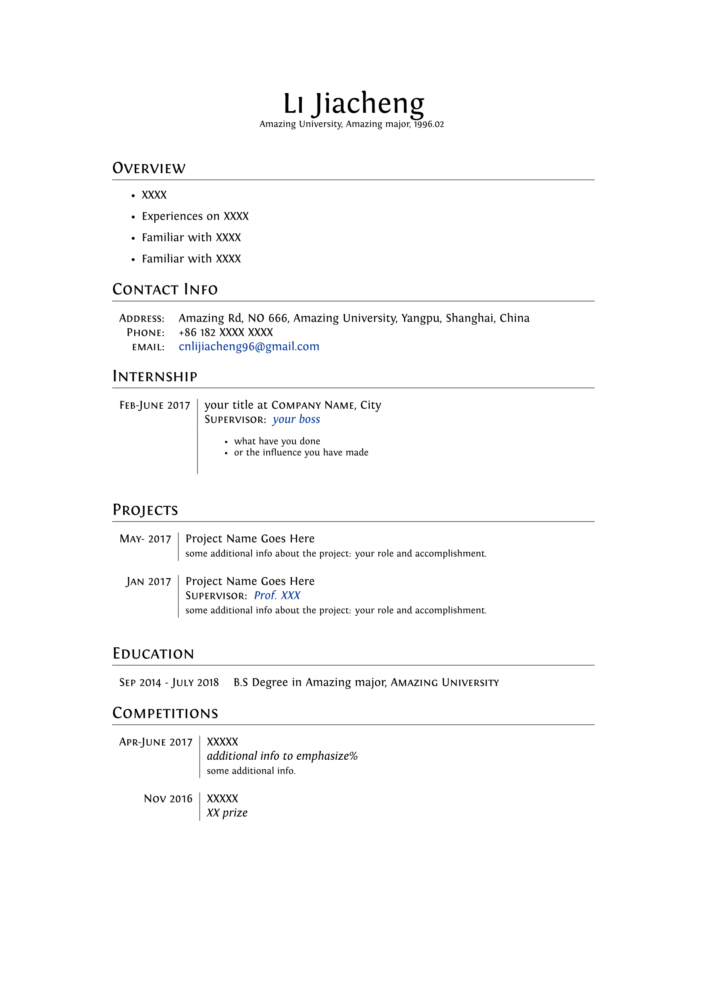

# A simple LaTeX Template for Resume
adopted based on template by Alessandro Plasmati @ [ShareLaTeX](https://www.sharelatex.com/templates/cv-or-resume/professional-cv).

## Usage
Engine: XeLaTeX

Download: [v0.1](https://github.com/ddlee96/latex_cv_template/releases/tag/0.1)

Use: Extract the zip file and modify .text files.

Tested on Ubuntu 16.04 with Textlive 2016

## English Ver.

Preview [PDF](./cv.pdf)

## Chinese Ver.

Preview [PDF](./cv_zh.pdf)
